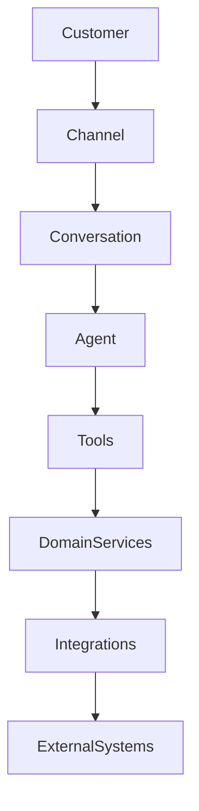
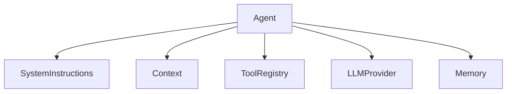

# Architecture Guidelines

This document outlines the architectural guidelines and design principles for the AI Receptionist platform.

## 1. Product Overview

The AI Receptionist platform will handle customer interactions through phone, SMS, web chat, and WhatsApp. It answers questions, collects missing information, checks availability, and schedules/cancels appointments using various LLMs.

## 2. System Architecture

The architecture relies on strict decoupling of concerns:



## 3. Monorepo Structure

- `apps/web`: Frontend Next.js app.
- `apps/api`: Backend FastAPI app.
- `packages/`: Shared packages across apps (e.g. `shared-types`).
- **Database:** Supabase (Managed PostgreSQL), pgvector
- **Infrastructure:** Local development (Native), Vercel (Frontend), Railway/Render (Backend)

## 4. Frontend Architecture
Next.js using App Router, TypeScript, Tailwind CSS, and shadcn/ui.

## 5. Backend Architecture
FastAPI application with dependency injection, SQLAlchemy for ORM, and Pydantic for schemas.

## 6. AI Agent Architecture



## 7. Tool-Calling Architecture

The LLM does not interact directly with APIs. It uses the `Tool` abstraction which delegates to `DomainServices` and `IntegrationAdapters`.

## 8. Channel Architecture

Incoming requests from all platforms (Web, Phone, SMS) are normalized into a generic format before reaching the AI.

## 9. Voice Architecture

```text
Phone Provider -> Voice Gateway -> STT -> Conversation Engine -> AI Agent -> Text Response -> TTS -> Voice Provider
```

## 10. SMS Architecture
Handled as asynchronous webhooks normalized by the Channel adapter.

## 11. Calendar Architecture
A generic `CalendarProvider` interface will abstract Google Calendar and Microsoft Calendar.

## 12. RAG Architecture
pgvector with embedded knowledge base chunks for business-specific contexts.

## 13. Database Architecture
Core entities: `User`, `Business`, `Service`, `Customer`, `Conversation`, `Message`, `Appointment`, `Integration`, `KnowledgeDocument`, `KnowledgeChunk`. We rely on Supabase as the managed Postgres provider.

## 14. Multi-tenancy
All resources must be scoped to a `business_id`.

## 15. Security
Strict separation of tenant data, API key management, webhook signature validation, PII protection.

## 16. Error Handling
Standardized error types (`ValidationError`, `IntegrationError`, `LLMError`, etc.) that do not leak external failures to the customer.

## 17. Observability
Centralized application logs, AI logs (latency, token usage, tool calls), and integration logs.

## 18. Deployment Architecture
Targeting Vercel for the Next.js frontend, a PaaS (like Render/Railway) for the FastAPI backend, and Supabase for Managed PostgreSQL.

## 19. Data Flow
Channel Normalization -> Intent Recognition -> Context Retrieval -> LLM / Tool Execution -> State Update -> Channel Formatting.

## 20. Future Scalability
Designed for stateless API processing to allow horizontal scaling. WebSockets for realtime interactions.

## 21. Technology Decisions
Python is chosen for the AI/Data ecosystem, TypeScript/React for the frontend ecosystem.

## 22. Architectural Tradeoffs
We sacrifice some initial development speed for strict decoupling, ensuring we can easily swap providers (LLMs, Calendars, Voice gateways) later.
