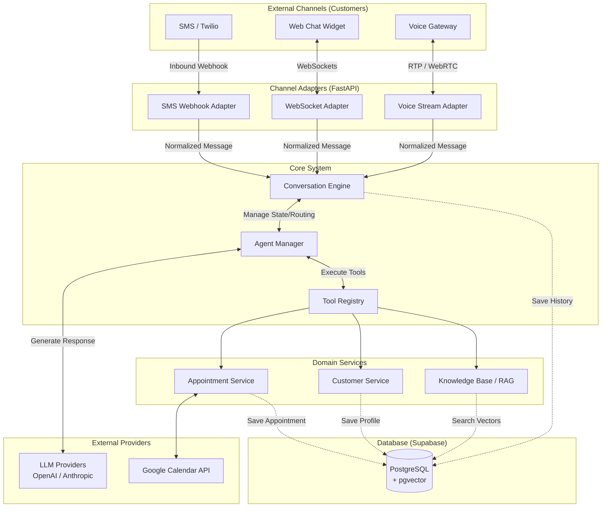

# AI Receptionist Architecture Diagram

This document provides a visual representation of the AI Receptionist's architecture, demonstrating the flow of data from external communication channels through the core engine to the LLM and database.

## Data Flow Sequence

```mermaid
sequenceDiagram
    autonumber
    actor Customer
    participant Channel as Channel (SMS/Web)
    participant Adapter as Channel Adapter
    participant Engine as Conversation Engine
    participant DB as Supabase (Postgres)
    participant Agent as Agent Manager
    participant LLM as LLM Provider
    participant Tools as Tool Registry
    participant Service as Domain Service
    
    Customer->>Channel: Sends Message
    Channel->>Adapter: Webhook / Payload
    
    rect rgb(30, 30, 50)
    Note over Adapter, Engine: 1. Normalization & Context
    Adapter->>Engine: NormalizedMessage
    Engine->>DB: Fetch Conversation History
    DB-->>Engine: History & Context
    end
    
    rect rgb(30, 50, 30)
    Note over Engine, LLM: 2. AI Processing
    Engine->>Agent: Generate Response (Message + History)
    Agent->>LLM: Prompt (System + History + Tools)
    LLM-->>Agent: Response (Text OR Tool Call)
    end
    
    alt LLM returns Tool Call
        rect rgb(50, 30, 30)
        Note over Agent, Service: 3. Tool Execution
        Agent->>Tools: Execute requested tool (e.g., book_appointment)
        Tools->>Service: Validate & Execute Business Logic
        Service->>DB: Persist Changes (e.g., Save Appointment)
        DB-->>Service: Success
        Service-->>Tools: Tool Result
        Tools-->>Agent: Tool Result
        Agent->>LLM: Send Tool Result
        LLM-->>Agent: Final Natural Language Response
        end
    end
    
    rect rgb(30, 30, 50)
    Note over Agent, Channel: 4. Response Egress
    Agent-->>Engine: Final AgentOutput
    Engine->>DB: Save new messages to History
    Engine-->>Adapter: Formatted Output
    Adapter-->>Channel: Egress Payload (Twilio / WS)
    Channel-->>Customer: Delivers Message
    end
```

